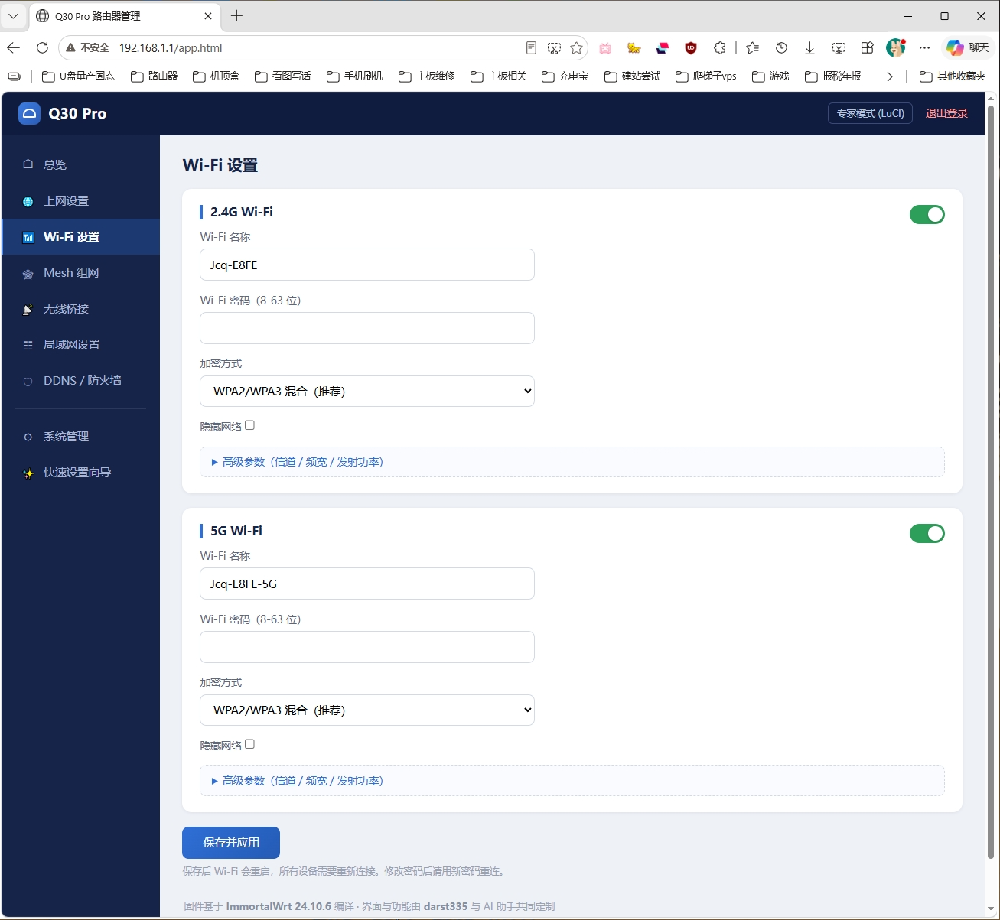
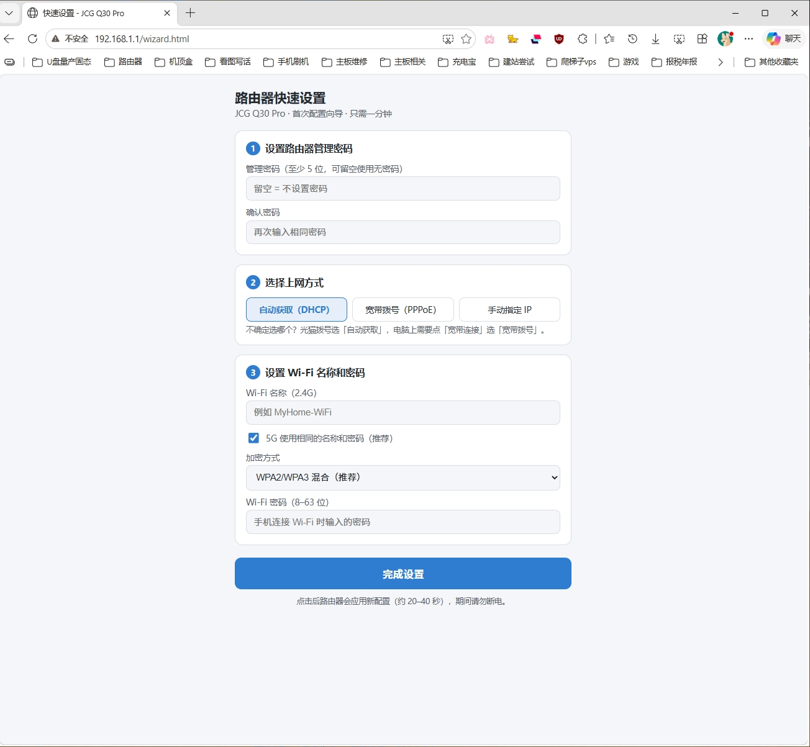
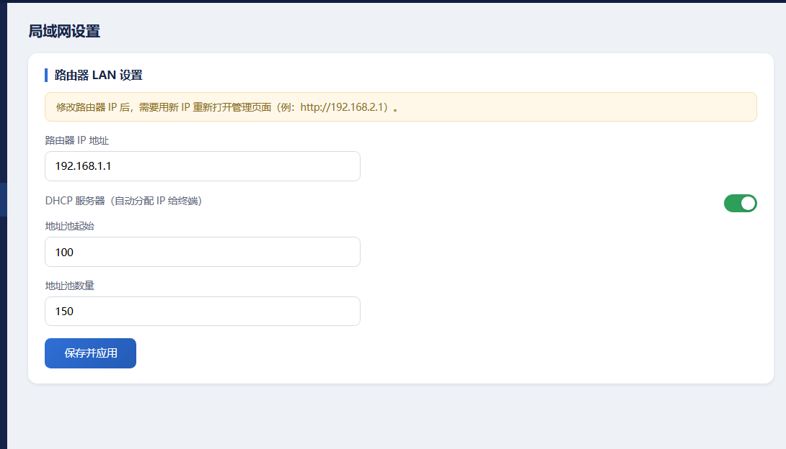

<div align="center">

# Q30 Wizard

**A fresh router experience for the JCG Q30 Pro (OEM export edition)**

[简体中文](README.md) | [English](README.en.md)

*Built on ImmortalWrt 24.10*

</div>

---

## 📖 Background

I picked up an **HNXT-C101 — a JCG Q30 Pro export edition custom-built for Hainan Xintong (HNXT)**.
The hardware is solid, but the stock UI is bare-bones. So I started this project together with an AI assistant:
**flash the device with ImmortalWrt 24.10 and design a clean, consumer-friendly admin UI from scratch.**

## 🖥️ Hardware & Stock Firmware

| Item | Spec |
|---|---|
| Model | HNXT-C101 (JCG Q30 Pro OEM export edition) |
| SoC | MediaTek MT7981B (dual-core Cortex-A53 @1.3 GHz) |
| RAM | 256 MB DDR3 |
| Flash | 128 MB SPI-NAND |
| Wi-Fi | Wi-Fi 6 AX3000 (2.4G 2×2 + 5G 2×2) |
| Wired | Gigabit Ethernet |

**Stock firmware**: HNXT-C101 v1.1.7, based on OpenWrt 21.02-SNAPSHOT (kernel 5.4.246), nginx + LuCI admin, weak web credentials `admin/admin`, and the root password baked straight into the squashfs (a factory reset doesn't clear it).

**Partition layout**:

```
BL2 | u-boot-env | Factory (radio calibration) | FIP (u-boot) | ubi (kernel + system)
```

## ✨ Features

- 🧙 **One-minute quick setup wizard** — launches automatically on first boot; SSIDs are pre-filled as `Jcq-` + last 4 digits of the MAC address (`Jcq-XXXX-5G` for 5 GHz), default Wi-Fi key `12345678`, and an empty admin password field means the default `admin`
- 📊 **Clean admin home** — device overview, internet setup (DHCP / PPPoE / static IP / **wired AP mode**), Wi-Fi settings (advanced: channel / bandwidth / TX power), Mesh networking, wireless relay, LAN settings
- 🛡️ **DDNS / firewall center** — dynamic DNS (DynDNS / No-IP / 3322 / Oray / Cloudflare / custom URL), port forwarding, DMZ, UPnP
- 🔑 **SSH enabled by default** (root / admin) for power users
- 🏭 **Expert mode preserved** — one click into full LuCI with every advanced option
- 📦 **Cloud builds** — GitHub Actions builds firmware automatically; grab and flash straight from the `dist` branch

## 🖼️ UI Preview

<details>
<summary><b>📷 Click to expand screenshots (4)</b></summary>
<br>

**Wi-Fi settings with advanced parameters**



**Quick setup wizard**



**LAN settings**



**Login**


> Open `docs/preview.html` in a browser for a paged gallery.

</details>

## 🛠️ The Flashing Journey

The flashing process was quite an adventure — key milestones:

1. **Getting SSH** — log into the stock web UI with the weak `admin/admin` credentials, then set the root password through LuCI's ubus API
2. **Full-chip backup** — dump every partition: BL2 / u-boot-env / Factory / FIP / ubi (never lose the Factory radio-calibration partition)
3. **The cross-version trap** — the stock 21.02 sysupgrade only accepts tar/ubi images and refuses the 24.10 `.itb`; the fix is to swap the bootloader first (official preloader + bl31-uboot.fip), then flash the system
4. **The red-LED "brick" mystery** — after the bootloader swap the LED went solid red. Disassembling U-Boot revealed the stock env had `bootcmd` hardcoded to `bootp` (an OEM network-provisioning feature), so the new U-Boot was endlessly waiting for a DHCP boot server. **Fix: run a DHCP + TFTP server on the PC and feed it the official initramfs rescue image** — no disassembly, no UART needed
5. **Flash the real firmware from the in-memory system** — once the initramfs booted, SSH in and sysupgrade. Done.

> ⚠️ The stock U-Boot performs no signature verification (verified: FIP only carries magic + CRC32). The Factory partition holds Wi-Fi calibration data — **never write to it**.

## 📦 Get the Firmware

Latest firmware (with this UI): [`dist` branch](../../tree/dist) → `immortalwrt-24.10.6-mediatek-filogic-jcg_q30-pro-squashfs-sysupgrade.itb`

Build it yourself: the repo ships a [GitHub Actions workflow](.github/workflows/build.yml) — every push builds automatically and force-pushes the image to the `dist` branch.

Flashing: upload the sysupgrade image via LuCI (System → Administration), or run `sysupgrade /tmp/xxx.itb` over SSH (drop `-n` to keep your config).

## ⚠️ Disclaimer

For study and research only. Flash at your own risk — always back up every partition first, and keep a UART adapter handy.

---

<div align="center">

*Crafted by darst335 together with an AI assistant*

</div>
